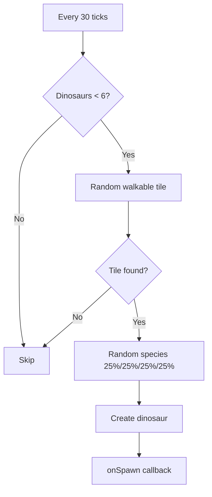
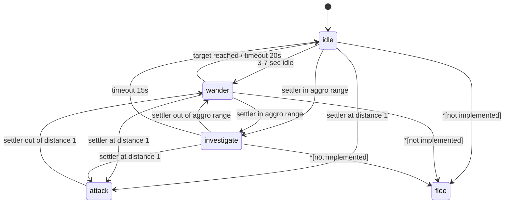
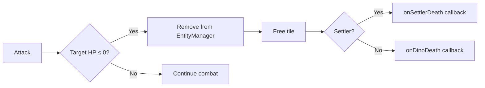

# Game Mechanics — Technical Documentation

> Colony Sim — a colony simulator on a planet with dinosaurs.

---

## Table of Contents

1. [Project Overview](#1-project-overview)
2. [Game Loop](#2-game-loop)
3. [Map Generation](#3-map-generation)
4. [Settler](#4-settler)
5. [Dinosaurs](#5-dinosaurs)
6. [Combat System](#6-combat-system)
7. [Buildings](#7-buildings)
8. [Resources](#8-resources)
9. [Artifacts and Achievements](#9-artifacts-and-achievements)
10. [Unimplemented Systems](#10-unimplemented-systems)

---

## 1. Project Overview

### Tech Stack

| Component | Technology |
|-----------|------------|
| Engine | Phaser 3.80 |
| Language | TypeScript 5.4 |
| Bundler | Vite 5.4 |

### Architecture

```
src/
├── core/           — Simulation, EntityManager, TileGrid, TaskQueue
├── data/           — JSON configurations (buildings, dinosaurs, tiles, texts)
├── entities/       — Entities (Settler, Dinosaur, Building, Resource, Artifact)
├── systems/        — Game systems (Combat, Dinosaur, Movement, Needs, Work, Building)
├── rendering/      — Rendering (TileRenderer, EntityRenderer, TextureGenerator)
├── ui/             — UI (UIManager, InputHandler, DebugPanel)
└── scenes/         — Scenes (BootScene, GameScene, UIScene)
```

### Configuration Files

| File | Purpose |
|------|---------|
| `src/config.ts` | Map dimensions, tile size, UI colors |
| `src/data/tiles.json` | Tile types, movement costs |
| `src/data/buildings.json` | Building types, costs, effects |
| `src/data/dinosaurs.json` | Dinosaur species, stats |
| `src/data/narrative.json` | Event texts (Russian) |
| `src/data/narrative.en.json` | Event texts (English) |

---

## 2. Game Loop

### Tick Rate

```typescript
// src/core/Simulation.ts:18
tickRate: number = 500; // 500 ms per tick
```

| Speed | Interval | Ticks per second |
|-------|----------|------------------|
| x1 | 500 ms | 2 |
| x2 | 250 ms | 4 |
| x4 | 125 ms | 8 |

### Time Constants

```typescript
// src/scenes/GameScene.ts:29
const TICKS_PER_DAY = 24;
```

### Update Cycle

```
GameScene.update()
  ├── Simulation.update(tickDelta)
  │     ├── NeedsSystem.update()         — hunger, energy
  │     ├── DinosaurSystem.update()      — dinosaur AI, spawning
  │     ├── BuildingSystem.update()      — building effects
  │     ├── CombatSystem.update()        — combat
  │     └── WorkSystem.update()          — settler tasks
  ├── TileRenderer.draw()                — tile rendering
  └── EntityRenderer.draw()              — entity rendering
```

---

## 3. Map Generation

### Dimensions

```typescript
// src/config.ts:2-3
MAP_WIDTH = 15;
MAP_HEIGHT = 15;
```

### Tile Probabilities

```typescript
// src/core/Simulation.ts:28-45
const rand = Math.random();
if (rand < 0.05)      → water   (5%)
else if (rand < 0.12) → stone   (7%)
else if (rand < 0.18) → sand    (6%)
else if (rand < 0.85) → grass   (67%)
else                   → dirt    (15%)
```

| Tile | Probability | Walkable | Movement Cost |
|------|-------------|----------|---------------|
| Grass | 67% | Yes | 1 |
| Dirt | 15% | Yes | 1 |
| Stone | 7% | Yes | 2 |
| Sand | 6% | Yes | 1 |
| Water | 5% | **No** | 999 |

> Each tile is generated independently — no biome clustering.

---

## 4. Settler

### Starting Stats

```typescript
// src/entities/Settler.ts:13-18
hunger: number = 100;
energy: number = 100;
hp: number = 100;
maxHp: number = 100;
attackCooldown: number = 0;
inventory: InventoryItem[] = [];
```

### Needs System

```typescript
// src/systems/NeedsSystem.ts:1-14
settler.hunger -= tickDelta * 0.05;   // hunger
settler.energy -= tickDelta * 0.03;   // energy

if (settler.hunger <= 0) {
    settler.energy -= tickDelta * 0.3;  // starvation penalty (x10)
}
```

| Parameter | Degradation Rate | Notes |
|-----------|------------------|-------|
| Hunger | -0.05 / tick | Floors at 0 |
| Energy | -0.03 / tick | Floors at 0 |
| Starvation penalty | -0.3 / tick | Only when hunger = 0 |

**Time to hunger:** 100 / 0.05 = 2000 ticks = **~16.7 minutes** (at x1)

> A starving settler loses energy 10x faster. Death from starvation is **not implemented** — HP is not affected.

### House Effect

```typescript
// src/systems/BuildingSystem.ts:35-41
if (this.isNearby(settler, bld, 3)) {
    settler.hunger += reduction * tickDelta;  // reduction = 0.5
}
```

- Range: Manhattan distance ≤ 3
- Restoration: +0.5 / tick (vs -0.05 degradation — **net x10**)
- Houses effectively **fully compensate** hunger within range

### Inventory

```typescript
// src/entities/Settler.ts:36-58
addToInventory(item): void     // add item
removeFromInventory(type, qty): boolean  // extract
hasResource(type, qty): boolean           // check presence
```

- Stacking by `resourceType`
- No capacity limit
- Resources consumed during building construction

### Pathfinding (A*)

```typescript
// src/systems/MovementSystem.ts:22-82
- Heuristic: Manhattan distance
- Neighbor expansion: 4-directional (up, down, left, right)
- Movement cost: from tiles.json (walkCost)
- Occupied tiles block path (except destination)
```

**Movement speed:** 1 tile per tick = **2 tiles/sec** at x1.

### Task System

```typescript
// src/core/Task.ts
enum TaskType {
    MoveTo = 'move_to',
    PickUp = 'pick_up',
    Build = 'build',
    Harvest = 'harvest',
    PickUpArtifact = 'pick_up_artifact',
}

enum TaskPriority {
    Low = 0,
    Normal = 1,
    High = 2,
}
```

Task queue is sorted by priority (highest first). By default the settler is **idle** — tasks are assigned by the player.

---

## 5. Dinosaurs

### Species and Stats

| Species | HP | Speed | Aggro | Damage | Size | Role |
|---------|-----|-------|-------|--------|------|------|
| T-Rex | 200 | 1 | 5 | **50** | 1.4 | Predator |
| Raptor | 60 | 3 | 4 | **15** | 0.8 | Predator |
| Brontosaur | 300 | 1 | 2 | **5** | 1.8 | Herbivore |
| Pterodactyl | 40 | 4 | 6 | **10** | 0.7 | Flying |

- **Predators** (PREDATOR_SPECIES): `trex`, `raptor` — attack all nearby dinosaurs
- **Herbivores**: `brontosaur`, `pterodactyl` — only fight back against predators

### Spawn System

```typescript
// src/systems/DinosaurSystem.ts:11-13
spawnInterval: number = 30;    // attempt every 30 ticks
maxDinosaurs: number = 6;      // maximum simultaneous
```



**Species probabilities:**

| Species | Probability |
|---------|-------------|
| T-Rex | 25% |
| Raptor | 25% |
| Brontosaur | 25% |
| Pterodactyl | 25% |

> Distribution is **uniform** — no weight or rarity modifiers.

**Spawn location:** up to 20 random attempts to find a walkable tile across the entire map.

### AI State Machine



**AI Parameters:**

| State | Trigger | Timeout |
|-------|---------|---------|
| idle → wander | 3 + random(0,4) sec | — |
| wander → idle | Target reached | 20 sec |
| investigate → idle | — | 15 sec |
| attack | Distance ≤ 1 | Cooldown 1.0 sec |

---

## 6. Combat System

### Settler vs Dinosaur

```typescript
// src/systems/CombatSystem.ts:37-63
damage = 10;                    // fixed damage
settler.attackCooldown = 1.0;   // 1 second between hits
```

- Settler attacks **nearest** dinosaur within range 1
- Damage **always hits** — no miss chance
- Armor / defense is **not implemented**

### Dinosaur vs Dinosaur

```typescript
// src/systems/CombatSystem.ts:66-98
damage = attacker.attackDamage;  // species-specific
dino.attackCooldown = 1.0;
```

- Predators attack **all** nearby dinosaurs
- Herbivores only fight back **against predators**
- Pair deduplication prevents double attacks per tick

### Dinosaur Damage to Settler

```typescript
// src/systems/DinosaurSystem.ts:132-147
nearestSettler.takeDamage(dino.attackDamage);
dino.attackCooldown = 1.0;
```

| Species | Damage | Hits to Kill (HP=100) | Time to Kill |
|---------|--------|-----------------------|--------------|
| T-Rex | 50 | 2 | 2 sec |
| Raptor | 15 | 7 | 7 sec |
| Brontosaur | 5 | 20 | 20 sec |
| Pterodactyl | 10 | 10 | 10 sec |

### Death Conditions

- **Settler:** HP ≤ 0 (only from dinosaur attacks)
- **Dinosaur:** HP ≤ 0 (from settler or other dinosaurs)
- Death from hunger/energy is **not implemented**



---

## 7. Buildings

### Building Types

| Building | Cost | Build Time | HP | Effect |
|----------|------|------------|-----|--------|
| House | 8 wood, 3 stone | 10 ticks | 100 | Restores hunger (+0.5/tick, range 3) |
| Warehouse | 10 wood, 5 stone | 12 ticks | 120 | Storage (50 capacity) |
| Farm | 6 wood | 8 ticks | 60 | Produces 2 food every 5 ticks |
| Workshop | 12 wood, 8 stone | 15 ticks | 150 | Placeholder (coming soon) |

### House Effect

```typescript
// src/systems/BuildingSystem.ts:35-41
// Hunger restoration within 3 tiles (Manhattan distance)
settler.hunger += 0.5 * tickDelta;
```

### Farm Effect

```typescript
// src/systems/BuildingSystem.ts:43-51
bld.produceTimer += tickDelta;
if (bld.produceTimer >= interval) {    // interval = 5
    bld.addToStorage('food', rate);     // rate = 2
}
```

- Production is **automatic** — no worker required
- Food is stored **inside the farm** (not in settler inventory)
- Food consumption by settlers is **not implemented**

### Placement Rules

```typescript
// src/ui/InputHandler.ts:143-184
1. Tile must be walkable (walkable = true)
2. Tile must not be occupied by another entity
3. Settler must have all required resources in inventory
```

> No adjacency requirements, biome restrictions, or other constraints exist.

---

## 8. Resources

### Types

| Resource | Starting Quantity | Nodes |
|----------|-------------------|-------|
| Wood | 30 (20 + 10) | 2 nodes: (2,2), (4,10) |
| Stone | 23 (15 + 8) | 2 nodes: (11,3), (9,8) |

### Gathering

```typescript
// src/systems/WorkSystem.ts:110,139
const amount = resource.harvest(5);  // 5 units per harvest
```

- Gathering is **deterministic** — always 5 units (or remainder)
- No probabilities or randomization
- Gathering is **player-initiated** (click → Collect)

### Farm Production

| Parameter | Value |
|-----------|-------|
| Type | `food` |
| Amount | 2 |
| Interval | 5 ticks |
| Rate | 0.4 food/tick |

---

## 9. Artifacts and Achievements

### Artifacts

Created when a settler kills a dinosaur:

```typescript
// src/scenes/GameScene.ts:224-228
const artifactName = `${e.killedSpecies} tooth`;
const artifact = new Artifact(x, y, 'trophy', artifactName);
```

| Dinosaur | Artifact |
|----------|----------|
| T-Rex | T-Rex tooth |
| Raptor | Raptor tooth |
| Brontosaur | Brontosaur tooth |
| Pterodactyl | Pterodactyl tooth |

- Artifacts have **no gameplay effects** — collectible value only
- Collected by settler via `PickUpArtifact` task

### Milestones

```typescript
// src/ui/UIManager.ts:481-489
checkMilestone(key: string): void {
    // Shown only once per game
    const msg = lines[Math.floor(Math.random() * lines.length)];
}
```

| Key | Trigger | Status |
|-----|---------|--------|
| `firstBuilding` | First building placed | Working |
| `firstResource` | First resource collected | Working |
| `survivedDino` | Defined in narrative.json | **Never called in code** |

### Narrative Events

- **Dinosaur spawn:** 2 text variants per species (random selection)
- **Combat:** 2 variants per event type (settlerAttack, dinoAttack, settlerDeath, dinoDeath)
- **Settler thoughts:** 15 phrases, rotated every 10 ticks

---

## 10. Unimplemented Systems

The following systems are **defined in code but not implemented**:

| System | Status |
|--------|--------|
| Weather | Does not exist |
| Settler morale | Does not exist |
| Death from starvation | Hunger reduces energy, not HP |
| Food consumption | Food is produced but never eaten |
| Auto-delivery to warehouse | `findWarehouse()` defined but never called |
| Building repair | `TaskType.Repair` defined, not implemented |
| Advanced crafting | Workshop described but empty |
| Miss chance | All attacks hit |
| Armor / defense | Does not exist |
| Critical hits | Does not exist |
| Waves / difficulty scaling | Does not exist |
| Biome clustering | Tiles generated independently |

---

> Documentation is current for project version `0.1.0` in `package.json`.
