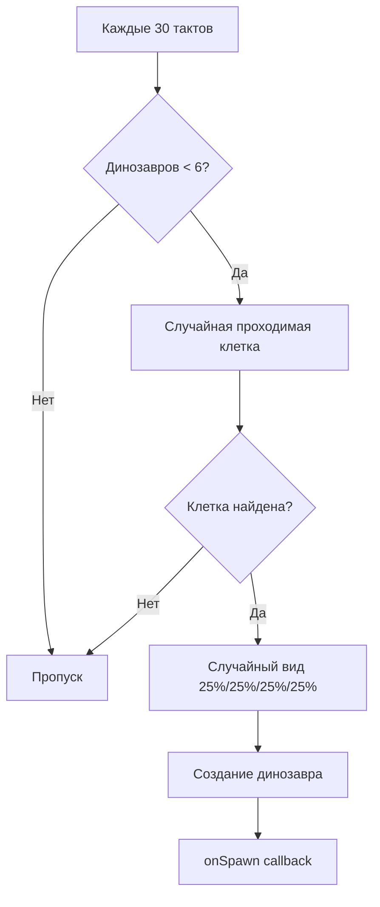
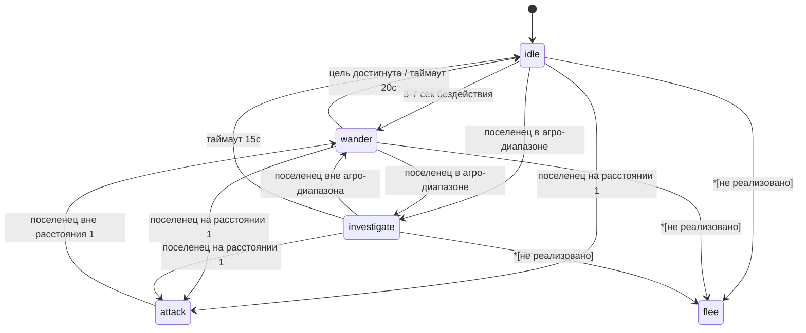
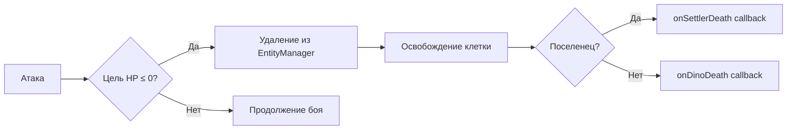

# Механики игры — Техническая документация

> Colony Sim — симулятор колонии на планете с динозаврами.

---

## Содержание

1. [Обзор проекта](#1-обзор-проекта)
2. [Игровой цикл](#2-игровой-цикл)
3. [Генерация карты](#3-генерация-карты)
4. [Поселенец](#4-поселенец)
5. [Динозавры](#5-динозавры)
6. [Боевая система](#6-боевая-система)
7. [Здания](#7-здания)
8. [Ресурсы](#8-ресурсы)
9. [Артефакты и достижения](#9-артефакты-и-достижения)
10. [Отсутствующие системы](#10-отсутствующие-системы)

---

## 1. Обзор проекта

### Стек технологий

| Компонент | Технология |
|-----------|------------|
| Движок | Phaser 3.80 |
| Язык | TypeScript 5.4 |
| Сборщик | Vite 5.4 |

### Архитектура

```
src/
├── core/           —imulation, EntityManager, TileGrid, TaskQueue
├── data/           — JSON-конфигурации (здания, динозавры, тайлы, тексты)
├── entities/       — Сущности (Settler, Dinosaur, Building, Resource, Artifact)
├── systems/        — Игровые системы (Combat, Dinosaur, Movement, Needs, Work, Building)
├── rendering/      — Отрисовка (TileRenderer, EntityRenderer, TextureGenerator)
├── ui/             — Интерфейс (UIManager, InputHandler, DebugPanel)
└── scenes/         — Сцены (BootScene, GameScene, UIScene)
```

### Файлы конфигурации

| Файл | Назначение |
|------|------------|
| `src/config.ts` | Размеры карты, тайлов, цвета UI |
| `src/data/tiles.json` | Типы тайлов, стоимость ходьбы |
| `src/data/buildings.json` | Типы зданий, стоимость, эффекты |
| `src/data/dinosaurs.json` | Виды динозавров, характеристики |
| `src/data/narrative.json` | Тексты событий (русский) |
| `src/data/narrative.en.json` | Тексты событий (английский) |

---

## 2. Игровой цикл

### Тактовый интервал

```typescript
// src/core/Simulation.ts:18
tickRate: number = 500; // 500 мс на такт
```

| Скорость | Интервал | Тактов в секунду |
|----------|----------|-------------------|
| x1 | 500 мс | 2 |
| x2 | 250 мс | 4 |
| x4 | 125 мс | 8 |

### Константы времени

```typescript
// src/scenes/GameScene.ts:29
const TICKS_PER_DAY = 24;
```

### Цикл обновления

```
GameScene.update()
  ├── Simulation.update(tickDelta)
  │     ├── NeedsSystem.update()         — голод, энергия
  │     ├── DinosaurSystem.update()      — ИИ динозавров, спавн
  │     ├── BuildingSystem.update()      — эффекты зданий
  │     ├── CombatSystem.update()        — бой
  │     └── WorkSystem.update()          — задачи поселенца
  ├── TileRenderer.draw()                — отрисовка тайлов
  └── EntityRenderer.draw()              — отрисовка сущностей
```

---

## 3. Генерация карты

### Размеры

```typescript
// src/config.ts:2-3
MAP_WIDTH = 15;
MAP_HEIGHT = 15;
```

### Вероятности тайлов

```typescript
// src/core/Simulation.ts:28-45
const rand = Math.random();
if (rand < 0.05)      → water   (5%)
else if (rand < 0.12) → stone   (7%)
else if (rand < 0.18) → sand    (6%)
else if (rand < 0.85) → grass   (67%)
else                   → dirt    (15%)
```

| Тайл | Вероятность | Проходим | Стоимость ходьбы |
|------|-------------|----------|-------------------|
| Grass | 67% | Да | 1 |
| Dirt | 15% | Да | 1 |
| Stone | 7% | Да | 2 |
| Sand | 6% | Да | 1 |
| Water | 5% | **Нет** | 999 |

> Каждый тайл генерируется независимо — кластеризации биомов нет.

---

## 4. Поселенец

### Стартовые характеристики

```typescript
// src/entities/Settler.ts:13-18
hunger: number = 100;
energy: number = 100;
hp: number = 100;
maxHp: number = 100;
attackCooldown: number = 0;
inventory: InventoryItem[] = [];
```

### Система нужд

```typescript
// src/systems/NeedsSystem.ts:1-14
settler.hunger -= tickDelta * 0.05;   // голод
settler.energy -= tickDelta * 0.03;   // энергия

if (settler.hunger <= 0) {
    settler.energy -= tickDelta * 0.3;  // штраф за голод (x10)
}
```

| Параметр | Скорость деградации | Примечание |
|----------|---------------------|------------|
| Голод | -0.05 / такт | До 0, дальше не падает |
| Энергия | -0.03 / такт | До 0 |
| Штраф голода | -0.3 / такт | Только когда голод = 0 |

**Время до голода:** 100 / 0.05 = 2000 тактов = **~16.7 минут** (при x1)

> Голодающий поселенец теряет энергию в 10 раз быстрее. Смерть от голода **не реализована** — HP не снижается.

### Эффект дома

```typescript
// src/systems/BuildingSystem.ts:35-41
if (this.isNearby(settler, bld, 3)) {
    settler.hunger += reduction * tickDelta;  // reduction = 0.5
}
```

- Радиус: манхэттен-расстояние ≤ 3
- Восстановление: +0.5 / такт (против -0.05 деградации — ** net x10**)
- Дом фактически **полностью компенсирует** голод в радиусе действия

### Инвентарь

```typescript
// src/entities/Settler.ts:36-58
addToInventory(item): void     // добавить предмет
removeFromInventory(type, qty): boolean  // извлечь
hasResource(type, qty): boolean           // проверить наличие
```

- Стекование по `resourceType`
- Лимит вместимости **не ограничен**
- Ресурсы потребляются при строительстве зданий

### Навигация (A*)

```typescript
// src/systems/MovementSystem.ts:22-82
- Эвристика: манхэттен-расстояние
- Расширение соседей: 4-направленное (вверх, вниз, влево, вправо)
- Стоимость движения: из tiles.json (walkCost)
- Занятые клетки блокируют путь (кроме конечной точки)
```

**Скорость перемещения:** 1 клетка за такт = **2 клетки/сек** при x1.

### Задачи (Task System)

```typescript
// src/core/Task.ts
enum TaskType {
    MoveTo = 'move_to',
    PickUp = 'pick_up',
    Build = 'build',
    Harvest = 'harvest',
    PickUpArtifact = 'pick_up_artifact',
}

enum TaskPriority {
    Low = 0,
    Normal = 1,
    High = 2,
}
```

Очередь задач сортируется по приоритету (высший первый). По умолчанию поселенец **бездействует** — задачи назначаются игроком.

---

## 5. Динозавры

### Виды и характеристики

| Вид | HP | Скорость | Агро | Урон | Размер | Роль |
|-----|-----|----------|------|------|--------|------|
| T-Rex | 200 | 1 | 5 | **50** | 1.4 | Хищник |
| Raptor | 60 | 3 | 4 | **15** | 0.8 | Хищник |
| Brontosaur | 300 | 1 | 2 | **5** | 1.8 | Травоядное |
| Pterodactyl | 40 | 4 | 6 | **10** | 0.7 | Летающее |

- **Хищники** (PREDATOR_SPECIES): `trex`, `raptor` — атакуют всех динозавров рядом
- **Травоядные**: `brontosaur`, `pterodactyl` — защищаются только от хищников

### Система спавна

```typescript
// src/systems/DinosaurSystem.ts:11-13
spawnInterval: number = 30;    // попытка каждые 30 тактов
maxDinosaurs: number = 6;      // максимум одновременно
```



**Вероятности по видам:**

| Вид | Вероятность |
|-----|-------------|
| T-Rex | 25% |
| Raptor | 25% |
| Brontosaur | 25% |
| Pterodactyl | 25% |

> Распределение **равномерное** — веса и модификаторы редкости отсутствуют.

**Локация спавна:** до 20 случайных попыток найти проходимую клетку на всей карте.

### Машина состояний ИИ



**Параметры ИИ:**

| Состояние | Триггер | Таймаут |
|-----------|---------|---------|
| idle → wander | 3 + random(0,4) сек | — |
| wander → idle | Достижение цели | 20 сек |
| investigate → idle | — | 15 сек |
| attack | Дистанция ≤ 1 | Кулдаун 1.0 сек |

---

## 6. Боевая система

### Поселенец vs Динозавр

```typescript
// src/systems/CombatSystem.ts:37-63
damage = 10;                    // фиксированный урон
settler.attackCooldown = 1.0;   // 1 секунда между ударами
```

- Поселенец атакует **ближайшего** динозавра в радиусе 1
- Урон **всегда попадает** — шанс промаха отсутствует
- Броня / защита **не реализованы**

### Динозавр vs Динозавр

```typescript
// src/systems/CombatSystem.ts:66-98
damage = attacker.attackDamage;  // species-specific
dino.attackCooldown = 1.0;
```

- Хищники атакуют **любых** динозавров рядом
- Травоядные защищаются **только** от хищников
- Дедупликация пар предотвращает двойной удар за такт

### Урон от динозавров поселенцу

```typescript
// src/systems/DinosaurSystem.ts:132-147
nearestSettler.takeDamage(dino.attackDamage);
dino.attackCooldown = 1.0;
```

| Вид | Урон | Ударов до смерти (HP=100) | Время до смерти |
|-----|------|---------------------------|-----------------|
| T-Rex | 50 | 2 | 2 сек |
| Raptor | 15 | 7 | 7 сек |
| Brontosaur | 5 | 20 | 20 сек |
| Pterodactyl | 10 | 10 | 10 сек |

### Условия смерти

- **Поселенец:** HP ≤ 0 (только от атак динозавров)
- **Динозавр:** HP ≤ 0 (от атак поселенца или других динозавров)
- Смерть от голода/энергии **не реализована**



---

## 7. Здания

### Типы зданий

| Здание | Стоимость | Время строительства | HP | Эффект |
|--------|-----------|---------------------|-----|--------|
| House | 8 wood, 3 stone | 10 тактов | 100 | Восстанавливает голод (+0.5/такт, радиус 3) |
| Warehouse | 10 wood, 5 stone | 12 тактов | 120 | Хранилище (50 единиц) |
| Farm | 6 wood | 8 тактов | 60 | Производит 2 food каждые 5 тактов |
| Workshop | 12 wood, 8 stone | 15 тактов | 150 | Заготовка (в будущем) |

### Эффект дома

```typescript
// src/systems/BuildingSystem.ts:35-41
// Восстановление голода в радиусе 3 клеток (манхэттен)
settler.hunger += 0.5 * tickDelta;
```

### Эффект фермы

```typescript
// src/systems/BuildingSystem.ts:43-51
bld.produceTimer += tickDelta;
if (bld.produceTimer >= interval) {    // interval = 5
    bld.addToStorage('food', rate);     // rate = 2
}
```

- Производство **автоматическое** — не требует 작업ника
- Еда хранится **внутри фермы** (не в инвентаре поселенца)
- Потребление еды поселенцем **не реализовано**

### Правила размещения

```typescript
// src/ui/InputHandler.ts:143-184
1. Тайл должен быть проходимым (walkable = true)
2. Тайл не занят другой сущностью
3. Поселенец должен иметь все нужные ресурсы в инвентаре
```

> Соседние требования, ограничения по биому и другие ограничения **отсутствуют**.

---

## 8. Ресурсы

### Типы

| Ресурс | Стартовое количество | Узлы |
|--------|----------------------|------|
| Wood | 30 (20 + 10) | 2 узла: (2,2), (4,10) |
| Stone | 23 (15 + 8) | 2 узла: (11,3), (9,8) |

### Добыча

```typescript
// src/systems/WorkSystem.ts:110,139
const amount = resource.harvest(5);  // 5 единиц за раз
```

- Добыча **детерминированная** — всегда 5 единиц (или остаток)
- Вероятности и рандомизация **отсутствуют**
- Добыча инициируется **игроком** (клик → Collect)

### Производство фермы

| Параметр | Значение |
|----------|----------|
| Тип | `food` |
| Количество | 2 |
| Интервал | 5 тактов |
| Скорость | 0.4 food/такт |

---

## 9. Артефакты и достижения

### Артефакты

Создаются при убийстве динозавра поселенцем:

```typescript
// src/scenes/GameScene.ts:224-228
const artifactName = `${e.killedSpecies} tooth`;
const artifact = new Artifact(x, y, 'trophy', artifactName);
```

| Динозавр | Артефакт |
|----------|----------|
| T-Rex | T-Rex tooth |
| Raptor | Raptor tooth |
| Brontosaur | Brontosaur tooth |
| Pterodactyl | Pterodactyl tooth |

- Артефакты **не имеют игровых эффектов** — только коллекционная ценность
- Собираются поселенцем через задачу `PickUpArtifact`

### Достижения (Milestones)

```typescript
// src/ui/UIManager.ts:481-489
checkMilestone(key: string): void {
    // Показывается только один раз за игру
    const msg = lines[Math.floor(Math.random() * lines.length)];
}
```

| Ключ | Триггер | Статус |
|------|---------|--------|
| `firstBuilding` | Первое здание построено | Работает |
| `firstResource` | Первый ресурс собран | Работает |
| `survivedDino` | Определён в narrative.json | **Не вызывается в коде** |

### Нарративные события

- **Спавн динозавра:** 2 варианта текста на вид (случайный выбор)
- **Бой:** 2 варианта на тип события (settlerAttack, dinoAttack, settlerDeath, dinoDeath)
- **Мысли поселенца:** 15 фраз, ротация каждые 10 тактов

---

## 10. Отсутствующие системы

Следующие системы **определены в коде, но не реализованы**:

| Система | Статус |
|---------|--------|
| Погода | Не существует |
| Мораль поселенцев | Не существует |
| Смерть от голода | Голод снижает энергию, но не HP |
| Потребление еды | Еда производится, но не естся |
| Автодоставка на склад | `findWarehouse()` определён, но не вызывается |
| Ремонт зданий | `TaskType.Repair` определён, не реализован |
| Продвинутый крафт | Workshop описан, но пустой |
| Шанс промаха | Все атаки попадают |
| Броня / защита | Не существует |
| Критические удары | Не существует |
| Волны / масштабирование сложности | Не существует |
| Кластеризация биомов | Тайлы генерируются независимо |

---

> Документация актуальна для версии проекта с `package.json` version `0.1.0`.
